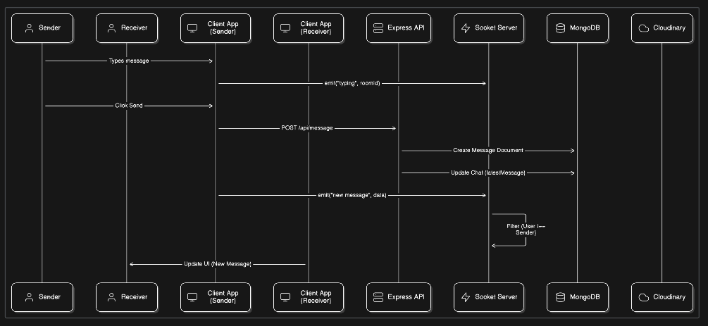
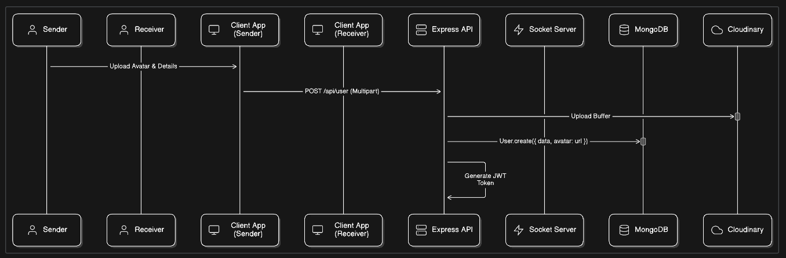
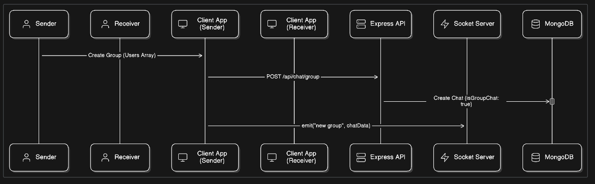

# 💬 Chat Buddies – Real-Time Messaging Platform

**Chat Buddies** is a full-stack real-time chat application built to facilitate seamless communication. It supports one-on-one messaging, dynamic group chats, and instant notifications, all powered by a robust **MERN Stack** and **Socket.io** architecture.

---

## Features

* **Real-Time Communication:** Instant messaging with sub-second latency using Socket.io.
* **Authentication:** Secure login and registration with JWT and Bcrypt.
* **Group Chats:** Create groups, add/remove members, and rename groups dynamically.
* **Typing Indicators:** Real-time visual feedback when users are typing.
* **File Sharing:** Cloud-based image handling for profile avatars and group icons via Cloudinary.
* **Responsive UI:** Optimized for seamless experience across devices.

---

## Tech Stack

| Domain | Technologies |
| :--- | :--- |
| **Frontend** | React.js, Tailwind CSS |
| **Backend** | Node.js, Express.js |
| **Database** | MongoDB |
| **Real-Time** | Socket.io (WebSockets) |
| **Cloud Storage** | Cloudinary |
| **Auth** | JWT |

---

## System Architecture & Workflows

### 1. Real-Time Messaging Flow
The core logic handling message persistence via REST API and instant delivery via WebSockets.


### 2. User Registration & Media Upload
Secure user creation process involving Cloudinary for asset management.


### 3. Group Creation Logic
How complex group associations are handled in the database and broadcasted to clients.


---

## 📂 Folder Structure

```text
chat-buddies/
│
├── .github/                    
│   └── workflows/              # CI/CD Configurations
│
├── frontend/                   # React Client Application
│   ├── src/
│   │   ├── components/         # ChatBox...
│   │   ├── context/            # ChatProvider (Context API)
│   │   ├── pages/              # ChatPage, HomePage
│   │   └── config/             # Chat Logics & API Configs
│   └── ...
│
└── backend/                    # Node/Express Server
    ├── config/                 # DB Connection & Token Generation
    ├── controllers/            # Chat, Message, & User Logic
    ├── models/                 # Mongoose Schemas (User, Chat, Message)
    ├── routes/                 # API Routes definitions
    ├── middleware/             # Auth & Error Handling
    └── index.js               # App Entry & Socket.io Setup

```

## Installation & Setup
```bash
1 git clone https://github.com/mohith0407/chat-buddies.git
cd chat-buddies
2️ Backend Setup
cd backend
npm install
npm run dev            # Start in development mode
3️ Frontend Setup
cd frontend
npm install
npm run dev            # Start in development mode
